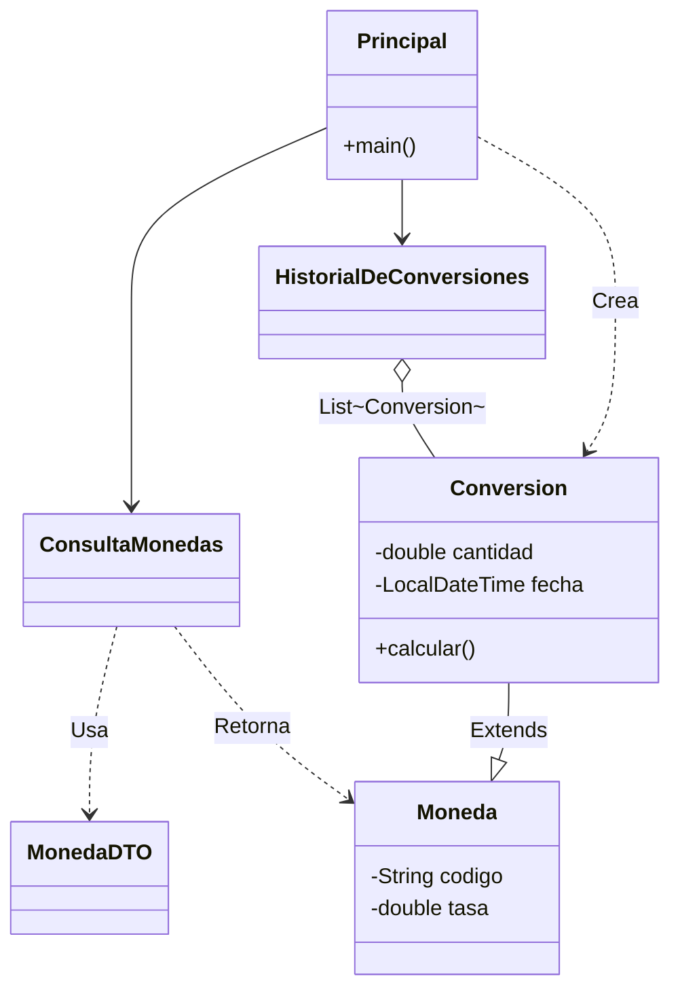

# 💱 Challenge: Conversor de Monedas


¡Bienvenido(a) al Challenge del Conversor de Monedas! 🚀

Este proyecto es una aplicación de **consola** desarrollada en **Java** que permite realizar conversiones de divisas en tiempo real utilizando la API de **ExchangeRate-API**. Aquí se aplican conocimientos de:
- Consumo de APIs (HttpClient, HttpRequest).
- Manipulación de datos JSON (Gson).
- Programación Orientada a Objetos (POO).
- Manejo de estructuras de datos (ArrayList y List) para el historial
- Registro dinámico de operaciones y manejo de tiempos (LocalDateTime).

> Un robusto conversor de divisas **de consola** que consume la API de ExchangeRate en tiempo real. Desarrollado como parte del desafío Back End Java, Orientado a objetos de Alura Latam (Oracle Next Education).
## 📸 Demo de Funcionamiento

El sistema ofrece una interfaz de consola interactiva, limpia y resistente a errores.

```text
====================================================
|           CONVERSOR DE MONEDAS              |
====================================================

  1) USD [Dolar]           >>>  ARS [Peso Argentino]
  2) ARS [Peso Argentino]  >>>  USD [Dolar]
  ...
  7) Personalizado (Ej: EUR, MXN, JPY)
  8) Ver Historial Completo
  0) Salir

====================================================
 >> Seleccione una opcion: 
95

Opción no válida
```

### ✨ Ticket de Conversión
Cada operación genera un comprobante detallado con fecha y hora exacta:

```text
====================================================
|              RESULTADO DE CONVERSION             |
====================================================

Moneda Origen:  [GBP]
Moneda Destino: [EUR]

Tasa de Cambio: 1,1453
----------------------------------------------------
Monto ingresado: 500,00 GBP
VALOR FINAL:     572,65 EUR
Fecha:           19/02/2026 09:50:26

====================================================
```

### 📜 Historial de Sesión
El sistema almacena todas las operaciones realizadas durante la ejecución:

```text
|||||||||||||||||||||||||||||||||||||||||||||||||||||
----------HISTORIAL DE CONVERSIONES.-----------------
|||||||||||||||||||||||||||||||||||||||||||||||||||||

[Ticket 1: USD -> ARS]
[Ticket 2: ARS -> USD]

||||||||||||||||||||||||||||||||||||||||||||||||||||||
---------------FIN HISTORIAL DE CONVERSIONES----------
||||||||||||||||||||||||||||||||||||||||||||||||||||||
```

---

## 🏗️ Arquitectura del Proyecto

El sistema sigue el patrón de diseño orientado a objetos, separando responsabilidades:



*   **Principal:** Controla el flujo del programa y la interacción con el usuario.
*   **ConsultaMonedas:** Se conecta a la API y obtiene los datos crudos.
*   **Conversion:** Realiza los cálculos matemáticos y gestiona la fecha.
*   **HistorialDeConversiones:** Almacena una lista de conversiones en memoria.
---

## 🛠️ Tecnologías y Herramientas

Este proyecto fue construido utilizando Java 17(LTS):

*   **Lenguaje:** [Java JDK 17](https://www.oracle.com/java/technologies/javase/jdk17-archive-downloads.html) (LTS).
*   **API Cliente:** `java.net.http.HttpClient` (Nativo de Java 11+).
*   **Manejo de JSON:** [Google Gson](https://github.com/google/gson) (Versión 2.10.1 o superior).
*   **IDE Recomendado:** IntelliJ IDEA / Eclipse.
*   **API de Tasas:** [ExchangeRate-API](https://www.exchangerate-api.com/).
---


## 📦 Instalación y Ejecución

1. **Clonar el repositorio:**
   ```bash
   git clone https://github.com/TU-USUARIO/conversor-monedas.git
   ```

2. **Importar el proyecto:**
   - Abre **IntelliJ IDEA**.
   - Selecciona `File > Open` y busca la carpeta del proyecto.

3. **Configurar Dependencias (Gson):**
   - Este proyecto utiliza la librería **Gson**.
   - Descarga el `.jar` desde Maven Repository o puede añadir La librería Gson 2.13.2 que ya está incluida en la carpeta /Lib del proyecto.
   - En IntelliJ: `File > Project Structure > Libraries`. Añade el `.jar`.
   
4. **Configurar la API Key (Seguridad):**
   * Obtén tu clave en [ExchangeRate-API](https://www.exchangerate-api.com/).
   * En IntelliJ IDEA:
      1. Ve al menú superior **Run** > **Edit Configurations...**.
      2. Selecciona la clase **Principal** en el panel izquierdo.
      3. Localiza el campo **Environment variables** y haz clic en el icono del documento (extremo derecho).
      4. En la ventana "Environment Variables", haz clic en el símbolo **+** (Add).
      5. Define la variable:
         * **Name:** `EXCHANGE_RATE_KEY`
         * **Value:** `tu_clave_aqui`
      6. Haz clic en **OK** en ambas ventanas para guardar.

5. **Ejecutar el programa:**
   - Abre la clase `Principal.java` y presiona **Run**.

---

## ✒️ Autor

<table>
  <tr>
    <td align="center">
      <a href="https://github.com/saturno024" target="_blank">
        <br />
        <sub><b>Carlos Fabian Mesa Muñoz</b></sub>
      </a>
    </td>
  </tr>
</table>

### 📢 Contacto
* 💼 <a href="https://www.linkedin.com/in/carlos-fabián-mesa-muñoz-7a544429a" target="_blank">LinkedIn</a>
* 🐙 <a href="https://github.com/saturno024" target="_blank">GitHub</a>
* 📧 [Email](mailto:fabianmesa24@hotmail.com)

---
©️ Hecho con ❤️ por **Carlos Fabian Mesa Muñoz** 😊
